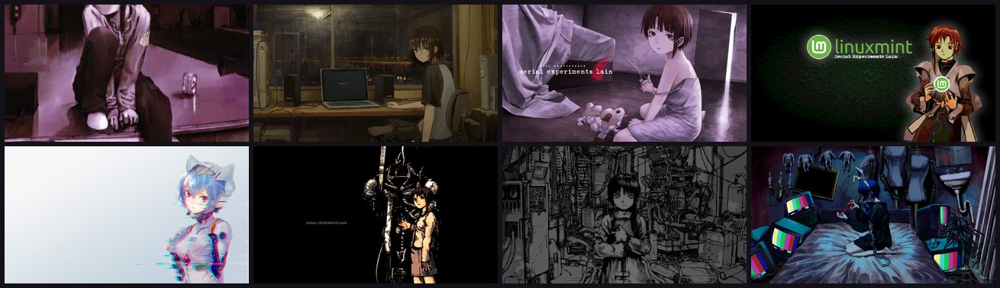
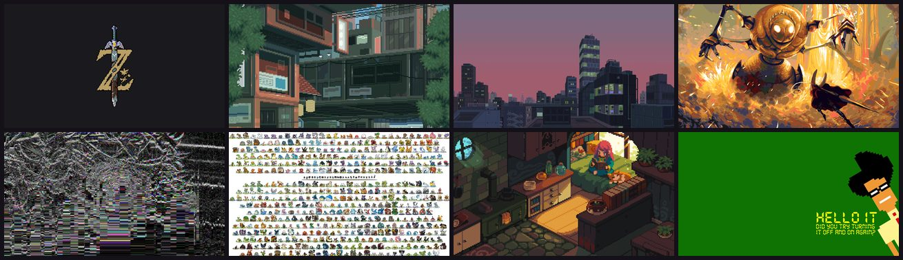
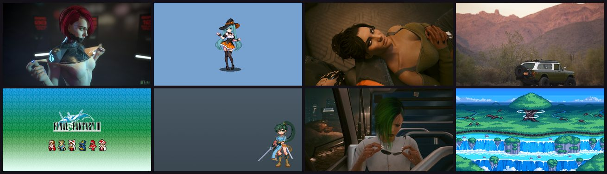
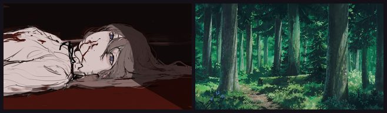
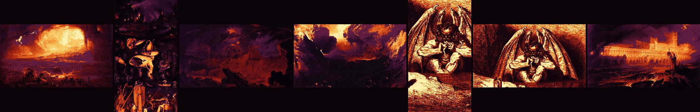

# PixelStreetArt Wallpapers

Wallpaper packs for the [PixelStreetArt Niri rice](https://github.com/MixaDoDs/AngelOS-Dotfiles)
and its angelOS shell. They used to live in the dotfiles repository; now the installer
downloads only the packs you pick.

| Pack | Pictures | Size | Preview |
|---|---:|---:|---|
| `Lain` — Serial Experiments Lain | 136 | ~410 MB |  |
| `Pixel` — pixel street art, games, cities | 100 | ~187 MB |  |
| `pixel-art-green-wallpapers` — green pixel art | 200 | ~275 MB |  |
| `wallpapers` — the rice defaults (also shipped with the dotfiles) | 2 | ~6 MB |  |
| `Hell` — pixel hell for angelOS's demon (public-domain paintings, see `Hell/CREDITS.md`) | 7 | ~0.4 MB |  |

## Install

With the dotfiles installer (it asks which packs you want):

```sh
./install.sh                                   # interactive: pick packs from a list
WALLPAPER_PACKS=Lain,Pixel ./install.sh        # unattended: these packs
WALLPAPER_PACKS=all ./install.sh               # everything
WALLPAPER_PACKS=none ./install.sh              # no packs
```

By hand — only the chosen folders are downloaded:

```sh
git clone --depth 1 --filter=blob:none --sparse https://github.com/MixaDoDs/PixelStreetArt_Wallpapers
cd PixelStreetArt_Wallpapers
git sparse-checkout set Pixel Lain             # the packs you want
cp -r Pixel Lain ~/Pictures/
```

angelOS picks up everything under `~/Pictures` (Settings → Wallpaper, or right-click
the desktop → Wallpaper ▸ Next / Random).

## По-русски

Паки обоев для rice PixelStreetArt и оболочки angelOS. `Hell` — пиксельный ад из картин в общественном достоянии (Джон Мартин, Доре, Босх): его ставит демоница angelOS. Установщик dotfiles спрашивает,
какие паки скачать (`WALLPAPER_PACKS=Lain,Pixel`, `all` или `none`), и загружает только их.
Вручную — `git sparse-checkout set <паки>`, как выше, и скопировать папки в `~/Pictures`.

## Credits

The pictures belong to their authors; they were collected from
[wallhaven.cc](https://wallhaven.cc) (the file names keep their wallhaven ids, so the
original page is `https://wallhaven.cc/w/<id>`). If you are an author and want a picture
removed or credited differently, open an issue.
